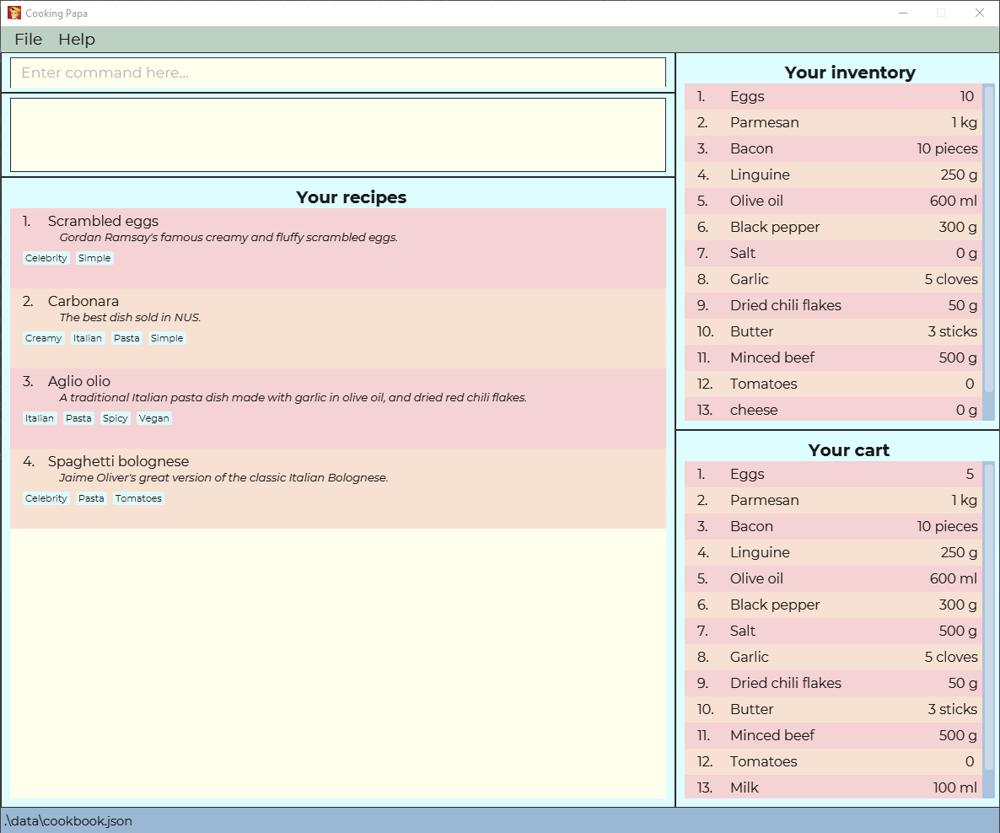

= Cooking Papa
ifdef::env-github,env-browser[:relfileprefix: docs/]

https://travis-ci.org/AY1920S2-CS2103T-F11-4/main[image:https://travis-ci.org/AY1920S2-CS2103T-F11-4/main.svg?branch=master[Build Status]]
https://ci.appveyor.com/project/teo-jun-xiong/main[image:https://ci.appveyor.com/api/projects/status/mkams6irqolkr5gp?svg=true[Build status]]
https://coveralls.io/github/AY1920S2-CS2103T-F11-4/main?branch=master[image:https://coveralls.io/repos/github/AY1920S2-CS2103T-F11-4/main/badge.svg?branch=master[Coverage Status]]
https://www.codacy.com/gh/AY1920S2-CS2103T-F11-4/main?utm_source=github.com&amp;utm_medium=referral&amp;utm_content=AY1920S2-CS2103T-F11-4/main&amp;utm_campaign=Badge_Grade[image:https://api.codacy.com/project/badge/Grade/aab1eba3906e4891a63020b0756e89f8[Codacy Badge]]

ifdef::env-github[]

endif::[]

ifndef::env-github[]
image::images/Ui.png[width="600"]
endif::[]

* Cooking Papa is a desktop application that makes cooking at home easier.
Cooking Papa provides a cookbook for users to search and add recipes.
It also allows users to manage their ingredient inventory and shopping list with ease.
* Target users are those who are interested to cook at home but finds it hard to
manage their ingredients inventory and shopping list.

== Site Map

* <<UserGuide#, User Guide>>
* <<DeveloperGuide#, Developer Guide>>
* <<AboutUs#, About Us>>
* <<ContactUs#, Contact Us>>

== Acknowledgements

* This application was built on the excellent AddressBook-Level3 project created by link:https://se-education.org[SE-EDU] initiative.
* Libraries used: https://openjfx.io/[JavaFX], https://github.com/FasterXML/jackson[Jackson], https://github.com/junit-team/junit5[JUnit5], https://commons.apache.org/proper/commons-math/[Apache Commons Math]

== Licence : link:LICENSE[MIT]
